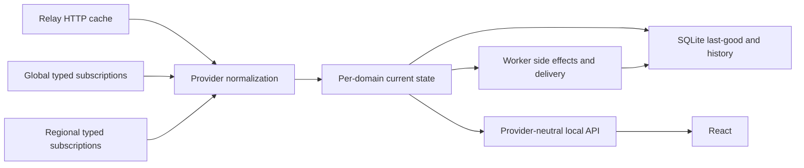

# Application overview

BitCraft Claim Monitor is a local-first settlement operations dashboard. The
maintained application is [`apps/bitcraft-local`](../apps/bitcraft-local/).

Local development uses frontend port `19428` and API port `19430`. The built
smoke server on `18449` is an optional verification tool, not a normal runtime
service.

## Runtime topology



The server discovers Relay topology from health and cache-readiness responses.
Relay HTTP adapters consume proven joined routes. Generated TypeScript bindings
drive the typed SpacetimeDB subscriptions; the application does not implement a
wire codec. The primary settlement region stays connected, while cross-region
market, public-craft, claim, empire, and map work uses bounded regional sessions.

## Provider and publication boundary

`apps/bitcraft-local/src/server/game-data/` owns topology, HTTP adapters, typed
sessions, schema validation, normalization, current-state publication, and
provider health. Relay field names and wire records stay behind this boundary.

Each domain publication is atomic. A schema fingerprint mismatch stops the
affected typed generation and retains the previous valid domain. Separate
domains can advance independently, so a response containing several domains is
not automatically one synchronized snapshot.

The public response makes that distinction explicit:

- `domainStatus` reports generation, freshness, confidence, receipt/source age,
  warnings, provenance, and declared enrichment dependencies for each requested
  domain;
- `meta.coherence` is `coherent`, `mixed`, or `unavailable`; and
- coherence compares known local application generations and exact dependency
  publications only. It does not claim simultaneous upstream observation.

When a source omits its own observation timestamp, reported age is based on
local receipt time and cannot prove upstream freshness.

## Browser contract and refresh

React reads same-origin, provider-neutral routes. The main contract is:

```http
GET /api/local/game-data?claimId=<configured-claim>&domains=claim,members
```

The requested claim must match the configured claim, and cross-region data is
restricted to configured active regions. Available last-good domains return
with stale/partial metadata; HTTP `503` is reserved for requests where none of
the requested domains has ever loaded.

Provider-neutral pages create one claim- and domain-scoped generation watcher.
SSE delivers prompt invalidation. Craft Monitor polls the generation endpoint
every second as a recovery path; other interval provider pages poll every 30
seconds. Hidden tabs do not poll and perform one visibility catch-up. Manual-only
and non-provider pages create no watcher.

Invalidation is single-flight and coalesced to one trailing cycle. A failed
generation cycle retries after 5, 10, 20, then at most 30 seconds. A queued
manual cycle runs before the background retry without discarding its deadline.
Ordinary interval failures retain their normal next-interval cadence.

Browser navigation data is scoped by claim and panel. Its cache uses access
order, at most eight entries, a 4 MiB conservative byte budget, and a five-minute
absolute TTL. Oversized or size-unknown responses remain usable for the active
request but are not retained.

Durable `/api/local/history` ownership is narrow: Dashboard requests activity,
market, and dashboard history; Activity requests activity; Settlement Market
requests market. Other pages issue no history request.

## Domain ownership

| Domain | Current authority |
| --- | --- |
| Claim, members, joined inventories/crafts, deposits | Relay HTTP cache |
| Storage events | Relay storage-log HTTP, copied durably before upstream expiry |
| Items, cargo, recipes, buildings, skills, resources, equipment, buffs | Global typed subscriptions |
| Construction, research, recruitment | Regional typed subscriptions plus global catalogs |
| Settlement and regional market | Regional order state and corroborated closure evidence |
| Equipment, buffs, player state | Member-filtered regional subscriptions |
| Layout and map | Claim/building/tile state plus bounded spatial/resource sessions |
| Empires, watchtowers, siege | Proven global rows and configured regional sessions |
| Charts, membership periods, notifications | Locally observed SQLite history |

Normalizers preserve 64-bit IDs and large integers as decimal strings and keep
item type `0` and cargo type `1` as different identities. Deposit `unknown` is
never treated as active or harvestable. A listing closure is a sale only when
corroborating evidence exists.

## Persistence and background work

SQLite owns:

- durable last-good domain envelopes and catalog projections;
- provider/subscription health, checkpoints, and provider-transition outboxes;
- locally observed storage, market, membership, production, activity, and
  notification history;
- Discord outbox/deduplication, user/admin settings, sessions, legal/privacy,
  audit, backup, and operational metadata.

Most Discord operational configuration is stored in `discord_json` and managed
through authenticated Admin. The bot token is stored in the protected secret
store unless an environment override is present. Environment variables can
override the token and Discord identity fields and own OAuth secrets, delivery
mode, gateway startup, sandbox-channel, and network safeguards.

In separated production, the worker owns long-running Relay acquisition,
reconciliation, history work, transition dispatch, scheduled jobs, and Discord
delivery. The web process owns HTTP assets, provider-neutral routes,
authentication, and administration. Local development uses the combined
process role.
Current market state and its compact transition are committed together; the
worker later leases and applies history/activity/Discord enqueue effects in a
separate bounded transaction. Current-state publication therefore does not wait
for those effects.

Discord outbox rows use durable leases. External delivery is at-least-once, not
exactly-once, because Discord acknowledgement and SQLite completion cannot be
one transaction.

Preview mode records automatic delivery and disables the gateway. It does not
disable all Discord HTTP by itself: authenticated exact-channel sandbox tests
can use the live API while `ENABLE_DISCORD_NETWORK` is enabled (the default).
Set `ENABLE_DISCORD_NETWORK=false` when the preview must be fully isolated from
Discord, including manual sandbox tests and interaction traffic.

Operational-history rollups and dry-run diagnostics exist, but destructive
retention is disabled: the runtime default is off, the approved table allowlist
is empty, and scheduled/Admin actions do not delete rows.

## Failure behavior and known limits

Relay HTTP requests use bounded timeouts, transient retry, and circuit-breaker
cooldown. Typed sessions reconnect with backoff and rediscover topology after
repeated failures. Source failure never clears a last-good generation.

The application deliberately does not invent unavailable semantics:

- siege cancellation remains removed-or-unknown;
- purchaser identity for a confirmed market sale remains unavailable;
- regional trade totals are locally observed confirmed sales from a displayed
  observation start, not a complete upstream historical aggregate; and
- cross-region coordinates are not assumed to share one geometry.

See [known Relay semantic limits](./relay-migration/unresolved-semantics-2026-08-02.md)
and the [deployment guide](../DEPLOYMENT.md).
