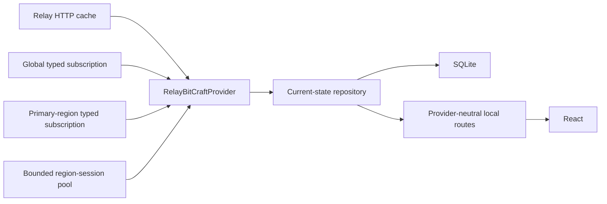

# Application overview

BitCraft Claim Monitor is a local-first settlement operations dashboard. The
standalone Relay repository keeps the public product name while isolating all
deployment identities and fresh data from the maintained application.

Local development uses frontend port `19428` and local API port `19430`.
The parallel preview is `https://relay.timbersteeltrade.com`.

## Runtime topology



The server discovers Relay topology from health and cache-readiness responses;
database names and ports are not hard-coded. HTTP adapters handle proven joined
routes. Official generated TypeScript bindings handle SpacetimeDB subscriptions;
the project does not implement a wire codec.

The primary region remains connected for the monitored settlement. Global
catalog subscriptions provide descriptions and recipes. Cross-region market and
empire work uses filtered, staggered sessions with connection and idle-close
budgets.

## Provider boundary

`apps/bitcraft-local/src/server/game-data/` owns the provider interface,
topology, HTTP adapters, typed sessions, normalization, current-state
repository, and provider health.

`RelayBitCraftProvider` implements:

- `start(config, sink)` for long-lived ingestion;
- `refresh(request)` for coordinated manual refresh;
- `health()` for source, schema, lag, reconnect, and apply diagnostics;
- `stop()` for orderly shutdown.

Provider commits use numbered staging generations. A domain becomes current only
after its required inputs validate, preventing mixed-generation reads. A schema
fingerprint mismatch stops the affected live generation and preserves
last-good data. The same interface reserves a later
`DirectBitCraftProvider`; React and SQLite do not depend on Relay wire DTOs.

## Browser contract

React requests only same-origin provider-neutral local routes. The main contract
is:

```http
GET /api/local/game-data?claimId=<configured-claim>&domains=claim,members
```

The response contains the configured claim and region, generation time, partial
domain envelopes, and partial errors. Each envelope records:

- `freshness`: live, fresh, stale, or unavailable;
- `confidence`: authoritative, joined, partial, or unknown;
- exact age and warnings;
- provider, source key, region, database, schema fingerprint, source time, and
  receive time provenance.

The claim must equal the configured monitored claim. Cross-region domains are
restricted to configured active regions. Last-good data returns `200` with
stale metadata; `503` is reserved for requests where no requested domain has
ever loaded.

Open provider-neutral pages subscribe to provider generation events for their
claim and owned domains, then refetch through `/api/local/game-data`. SSE is the
low-latency path. Craft Monitor uses a one-second recovery poll; other interval
provider pages use a 30-second recovery poll. Polling pauses while the tab is
hidden and visibility restoration produces one catch-up cycle. Manual and
non-provider pages create no generation watcher.

Generation invalidations are single-flight and coalesced to one trailing cycle.
Generation-triggered failures retry after 5, 10, 20, then at most 30 seconds;
a successful cycle resets that backoff. Ordinary interval failures retain their
normal next-interval cadence.

Durable `/api/local/history` projections also have exact page ownership:
Dashboard requests activity, market, and dashboard history; Activity requests
activity; Local Market requests market. Other pages issue no history request and
do not enroll a history task in the page refresh cycle.

## Domain ownership

| Domain | Current authority |
| --- | --- |
| Claim summary, members, joined inventories/crafts | Relay HTTP cache |
| Storage events | Relay storage-log HTTP, durably copied before expiry |
| Deposits | Relay HTTP with explicit active, respawning, or unknown state |
| Items, cargo, recipes, buildings, skills, resources, equipment, buffs | Global typed subscription |
| Construction, research, recruitment | Regional typed subscriptions plus global catalogs |
| Market | Regional buy/sell order state enriched with catalog, building, claim, and player indexes |
| Equipment, buffs, player state | Member-ID-filtered regional subscriptions |
| Layout and map | Claim/building/tile state plus bounded entity-location subscriptions |
| Empires, watchtowers, siege | Proven global rows or configured regional sessions |
| Charts, membership periods, notifications | Locally derived SQLite history |

Regional craft-progress transactions provide contributor attribution. Listing
closure is classified as sold only with corroborating trade/close evidence;
otherwise it remains removed or cancelled. Deposit `unknown` never means active
or harvestable.

## Persistence ownership

Wire records never enter React or history tables directly. Normalizers preserve
64-bit IDs and large integers as decimal strings and include item kind in every
item/cargo key.

SQLite owns:

- atomic current-domain envelopes and normalized catalog projections;
- restart-safe checkpoints and source/subscription health;
- durable storage, market, membership, production, and notification events;
- locally observed history and analytics;
- admin, user, consent, legal, Discord, outbox, dedupe, delivery, and audit
  state;
- backup and operational metadata.

SQLite does not own retired browser snapshots or periodic catalog caches used as
a substitute for live data. Current pages read committed Relay generations.
History tables remain because upstream event retention is finite and because
charts, transition semantics, and notification dedupe require durable local
observation.

## Background operation and failures

The web and worker processes continue ingestion, history, analytics, and
notification processing without a browser. Relay HTTP requests use bounded
timeouts, retry only transient failures, and enter a circuit-breaker cooldown.
Typed sessions reconnect with jittered backoff and rediscover topology after
repeated failures.

An upstream outage never clears a last-good generation. Admin health surfaces
readiness, schema fingerprints, lag, reconnects, malformed rows, apply time, and
the last error. Browser pages display freshness and cause rather than silently
showing old data as live.

## Assets

Runtime icons prefer `/game-icons/`. Missing verified local assets may use the
bounded same-origin `/api/local/game-icon/:itemType/:itemId` fallback.
`apps/bitcraft-local/assets/game-icons-manifest.json` is immutable build-time
provenance and is not used as a runtime URL source. Its original source URLs are retained
only to prove identity, permission, retrieval time, and SHA-256 digest.

## Deployment isolation

The Relay service uses:

- `/opt/bitcraft-claim-monitor-relay`
- `/var/lib/bitcraft-claim-monitor-relay`
- `/var/backups/bitcraft-claim-monitor-relay`
- `/etc/bitcraft-claim-monitor-relay.env`
- `bitcraft-claim-monitor-relay.service`
- `bitcraft-claim-monitor-relay-worker.service`
- local port `19430`

Preview Discord is forced to record mode at process execution. The maintained
application and its database remain untouched until cutover gates pass.
Automatic Discord work remains recorded. Authenticated manual tests are the
only exception and can post only to the exact configured sandbox Discord
channel, with mentions disabled.
